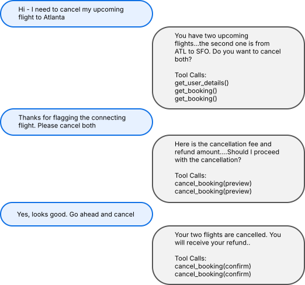

# STATE-Bench


[](https://opensource.microsoft.com/blog/2026/05/19/introducing-state-bench-a-benchmark-for-ai-agent-memory/)


A multi-domain benchmark for evaluating AI agents with agentic memory. It measures whether agents can learn from prior trajectories and improve on realistic enterprise tasks.

## Current Benchmark Shape

STATE-Bench tasks are interactive domain scenarios an agent is likely to encounter in enterprise settings. Each domain exposes a fixed set of tools (e.g. book_flight()) and policies available to the agent while executing tasks. Each task starts from a just-in-time sandbox with task-specific users and domain artifacts such as flight bookings, customer orders, carts, and product records.

The benchmark currently contains 450 scenarios across 3 enterprise domains: Travel, Customer Support, and Shopping Assistant. The public release includes 300 train trajectories for memory extraction and 150 test task definitions with test environments for locked evaluation.

Each domain has a locked train/test split of 100 train tasks and 50 test tasks, defined in `state_bench/domains/<domain>/splits/train_test.json`.

| Domain | Scenarios | Public Train Trajectories | Public Test Tasks | Description |
|--------|---------:|--------------------------:|------------------:|-------------|
| **Travel** | 150 | 100 | 50 | Flights, hotels, and car rentals with cancellations, rebookings, fee calculations, policy reasoning, and multi-step booking flows |
| **Customer Support** | 150 | 100 | 50 | Returns, refunds, exchanges, warranties, shipping claims, and challenge scenarios with policy gates and two-step enforcement |
| **Shopping Assistant** | 150 | 100 | 50 | Product search, comparison, cart management, promo codes, and compatibility checks |

<br/>

<p align="center">
  
  <br/>
  <em>Sample task trajectory from the Travel domain.</em>
</p>

## Requirements

STATE-Bench supports Python 3.12+.

Install the [uv](https://docs.astral.sh/uv/) package manager:

```bash
curl -LsSf https://astral.sh/uv/install.sh | sh
```

Install the package dependencies:

```bash
uv sync
```

## Bring Your Own Memory

STATE-Bench is designed to isolate memory logic from benchmark plumbing. To keep comparisons fair, the benchmark provides train trajectories, test tasks, domain tools, user simulator, judge, trajectory format, scoring protocol, and `StateBenchAgent` execution loop.

Users bring the memory logic: extract reusable procedural learnings from train trajectories, then expose those learnings through a `StateBenchAgent` subclass with `retrieve_learnings(query, top_k=3) -> list[str]`. During the locked GPT-5.1 test run, STATE-Bench adds that method as a model-callable tool while preserving the benchmark task loop, domain tools, user simulator, judge, trajectory format, scoring protocol, and model pricing. The official score measures whether those learnings improve task completion, reliability, user experience, and cost.

## Run Benchmark

See [RUN_BENCHMARK.md](RUN_BENCHMARK.md) for the official benchmark workflow, including required GPT-5.1 credentials and provider configuration.

## Scoring And Metrics

| Metric | Method |
|--------|--------|
| **Task Completion Rate** | Average completion rate across five runs per task. State-mutating tasks are checked with deterministic final-state scoring; non-state procedural and informational tasks are judged by an LLM evaluator for correct process and reasoning. |
| **Reliability** | `pass^5`: percentage of tasks completed successfully on all five runs. |
| **User Experience (UX) Score** | LLM-judged conversation quality on a 1-5 scale, focused on user experience rather than task completion. |
| **Cost Per Task** | Average cost to run a task, computed from provider-reported usage and the locked GPT-5.1 pricing in `state_bench/configs/pricing.yaml`. |

## License

STATE-Bench is released under the MIT License. See [LICENSE](LICENSE).

## Trademarks

This project may contain trademarks or logos for projects, products, or services. Authorized use of Microsoft trademarks or logos is subject to and must follow Microsoft’s Trademark & Brand Guidelines. Use of Microsoft trademarks or logos in modified versions of this project must not cause confusion or imply Microsoft sponsorship. Any use of third-party trademarks or logos are subject to those third-party’s policies.

## Disclosures

Datasets provided in this benchmark were synthetically generated using large language models. The benchmark is intended for research purposes and users should exercise caution and consider the limitations of synthetic data when interpreting results.
