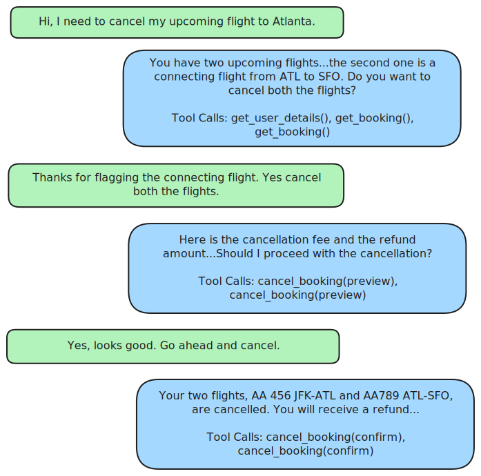

# STATE-Bench

<p align="center">
  
</p>

<p align="center">
  
  <a href="https://opensource.microsoft.com/blog/2026/05/19/introducing-state-bench-a-benchmark-for-ai-agent-memory/"></a>
</p>

<p align="center">
  <a href="RUN_BENCHMARK.md">Run Benchmark</a> &nbsp;·&nbsp; <a href="MEMORY_TRACK.md">Memory Track</a>
</p>

STATE-Bench is a benchmark for evaluating AI agents on realistic, multi-turn enterprise workflows across travel, customer support, and shopping assistance.

Given a task-local sandbox database, a domain's tool API, and a simulated user, an agent must complete the task by gathering information, applying policy, asking for consent when appropriate, and producing a correct final state — judged on both the deterministic database outcome and the conversation's adherence to per-task behavioral requirements.

## Why STATE-Bench

- **Realistic enterprise scope.** 450 tasks across 3 domains (150 each), every task backed by a per-task sandbox with bookings, orders, carts, warranties, and inventory — not toy worlds.
- **Both state and process are scored.** Deterministic final-state checks **plus** an LLM judge on per-task behavioral requirements (consent, disambiguation, policy explanation). An agent that mutates the right rows but lies to the user still fails.
- **Adversarial and policy-dense.** Many tasks are challenge scenarios — adversarial users, ambiguous references, stacked policy interactions — that punish shallow tool-calling loops and reward agents that read policy, ask clarifying questions, and refuse out-of-scope requests.

## Overview

| Domain | Tasks | Main Scenario |
| --- | ---: | --- |
| **Travel** | 150 | Flights, hotels, and car rentals; cancellations, rebooking, fee and policy reasoning, cross-product trip planning |
| **Customer Support** | 150 | Returns, refunds, exchanges, warranties, and shipping claims with policy gates and two-step write enforcement |
| **Shopping Assistant** | 150 | Product search, cart mutation, promo stacking, loyalty redemption, shipping options, and compatibility checks |

<br/>

<p align="center">
  
  <br/>
  <em>Sample task trajectory from the Travel domain.</em>
</p>

### 🧠 Specialized Memory Track

STATE-Bench also ships a dedicated track for evaluating agentic memory that learns from past trajectories. The track measures whether retrieved learnings improve agent performance on future tasks.

Switch to [MEMORY_TRACK.md](MEMORY_TRACK.md) for the full track specification and submission workflow.

## How to Run

STATE-Bench supports Python 3.12+.

**1. Install [uv](https://docs.astral.sh/uv/).**

```bash
curl -LsSf https://astral.sh/uv/install.sh | sh
```

**2. Clone the repo and sync dependencies.**

```bash
git clone https://github.com/microsoft/STATE-Bench.git
cd STATE-Bench
uv sync
```

For instructions on how to run the benchmark, follow [RUN_BENCHMARK.md](RUN_BENCHMARK.md).

## Metrics

| Metric | Method |
|--------|--------|
| **Avg. Pass@1** | Average task completion rate across five runs per task. State-mutating tasks are checked with deterministic final-state scoring; non-state procedural and informational tasks are judged by an LLM evaluator for correct process and reasoning. |
| **Pass^5** | Percentage of tasks completed successfully on all five runs. |
| **User Experience (UX) Score** | LLM-judged conversation quality on a 1–5 scale, focused on user experience rather than task completion. |
| **Cost Per Task** | Average cost to run a task, computed from provider-reported usage and the locked GPT-5.1 pricing in `state_bench/configs/pricing.yaml`. |

## License

STATE-Bench is released under the MIT License. See [LICENSE](LICENSE).

## Trademarks

This project may contain trademarks or logos for projects, products, or services. Authorized use of Microsoft trademarks or logos is subject to and must follow Microsoft’s Trademark & Brand Guidelines. Use of Microsoft trademarks or logos in modified versions of this project must not cause confusion or imply Microsoft sponsorship. Any use of third-party trademarks or logos are subject to those third-party’s policies.

## Disclosures

Datasets provided in this benchmark were synthetically generated using large language models. The benchmark is intended for research purposes and users should exercise caution and consider the limitations of synthetic data when interpreting results.
